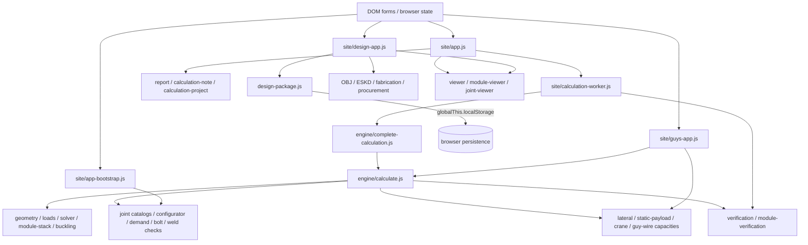
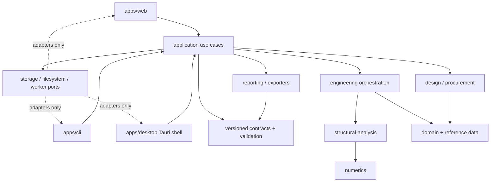

# Architecture Foundation 2.0 — current-state audit

Issue: #50  
Parent epic: #49

This document is the human-readable map of the current architecture. The exhaustive, reproducible module/import/export/LOC/test inventory is produced by:

```bash
npm run audit:architecture:report
npm run audit:architecture:json
```

The CI policy is checked by:

```bash
npm run audit:architecture
npm run test:architecture
```

The checked-in baseline is `docs/architecture/architecture-baseline.json`. It is deliberately narrow: exact-path exceptions only, with a reason and an owner issue. Git history is the compatibility archive; foundation work must not preserve parallel legacy implementations in the working tree.

## 1. Current-state dependency diagram



### Observed architectural facts

1. `site/engine/**` is already mostly headless numerical/engineering code, but it is not yet a real package boundary. Web entry points deep-import arbitrary engine modules.
2. `CalculationResult` is not created atomically. It is progressively enriched in `calculate.js`, `complete-calculation.js`, and `calculation-worker.js`.
3. `app-bootstrap.js` contains engineering preview logic and directly calls low-level bolt/nut/weld functions.
4. `guys-app.js` independently reconstructs mast input/defaults and invokes low-level mast calculation instead of one application use case.
5. `design-package.js` mixes a portable versioned package codec with browser `localStorage` persistence.
6. Result/report/design structures are de-facto public contracts, but most have no explicit transport schema/version.

## 2. Target-state diagram



Required dependency direction:

```text
apps/adapters
  -> application
    -> engineering/design/reporting
      -> structural-analysis/domain
        -> numerics
```

Lower layers must never import browser, Tauri, filesystem, process, Worker, or UI modules.

## 3. Module ownership map

The generated audit output is the authoritative per-file table. The responsibility map below is the migration view used by #52–#57.

| Current modules | Current responsibility | Target owner | Notes |
|---|---|---|---|
| `site/engine/calculate.js` | parameter resolution + engineering orchestration + capacity orchestration + result assembly | `application` + `engineering` | currently too broad; split without changing formulas |
| `site/engine/complete-calculation.js` | compatibility wrapper + post-calculation enrichment | `application` | should disappear after consumers use one canonical use case |
| `geometry.js`, `reference-frame.js` | FEM geometry/reference frame | `structural-analysis` | headless |
| `loads.js` | distributed/nodal load construction | `structural-analysis` | `topPointLoadN` is internal fixture input, not project input |
| `solver.js`, `module-stack.js`, `module-verification.js`, `buckling.js` | structural solution/cross-checks | `structural-analysis` | solver algorithms separated from orchestration |
| `linear-algebra.js`, `banded.js` | numerical primitives | `numerics` | lowest layer |
| `catalog.js`, `reference-data.js`, `weather.js` | materials/reference/weather resolution | `domain` | public data should be exposed through explicit API, not deep imports |
| `connection-catalog.js`, `metric-thread-catalog.js`, `joint-hardware-catalog.js` | physical hardware/reference data | `domain` | catalogs are domain/reference data |
| `joint-configurator.js`, `joint-demand.js`, `connection-check.js`, `bolt-*.js`, `weld-*.js`, `joint-section-check.js` | connection engineering | `engineering/connections` | UI must not call individual checks directly |
| `lateral-capacity.js`, `static-payload-capacity.js`, `crane-boom-capacity.js` | special limit cases | `engineering/capacity` | remain on same structural core |
| `guy-wire-catalog.js`, `guy-wire-system.js` | guy-wire domain + nonlinear guy calculation | `engineering/guys` | app input construction moves out of `guys-app.js` |
| `assembly-mass.js`, `procurement-estimate.js` | mass/procurement derivations | `design` | result derivations owned by application/design use cases |
| `report.js`, `calculation-note.js`, `calculation-project.js` | report projection/rendering | `reporting` | must consume complete immutable result |
| `design-package.js` | package schema/codec **and browser persistence** | `contracts/project-package` + adapter | split required; current browser coupling is baseline debt |
| `technical-projection.js`, `fabrication-project-appendix.js`, `eskd-construction-documentation.js`, `detailed-mast-model.js`, `obj-export.js` | manufacturing/design/export projections | `design/reporting` | pure projection should stay headless |
| `site/calculation-worker.js` | worker transport + optimization orchestration + result mutation | Web adapter only | after #54: deserialize request → call application → serialize response |
| `site/app.js` | form/defaults/validation/orchestration/report/download/render | Web adapter | must become thin; no engineering formula ownership |
| `site/app-bootstrap.js` | joint form construction + preview engineering checks | Web adapter | low-level engineering calls are leakage |
| `site/guys-app.js` | second mast input pipeline + guys UI | Web adapter | duplicate mast DTO assembly |
| `site/design-app.js` | design workspace + browser persistence/export filenames/download | Web adapter | filesystem/browser operations remain adapter concerns |
| viewers/UI helper modules | rendering only | Web adapter | must consume transport/application DTOs only |

## 4. CalculationResult lifecycle and mutation inventory

### Current lifecycle

```text
raw form/consumer input
  -> resolveCalculationParameters()
  -> calculateMast()/calculateCompleteMast()
  -> complete-calculation enrichment
  -> Worker enrichment
  -> UI/report/design/procurement consumers
```

### Mutation points

| Stage | Mutation | Consumers relying on it | Problem | Owner issue |
|---|---|---|---|---|
| `calculateMast()` | creates base result, then assigns `result.connections` | complete calculation, guys/bare mast consumers | base and complete result shapes differ | #53/#54 |
| `calculateCompleteMast()` | replaces `result.parameters` with fixed selected joint values; annotates connections | all complete-result consumers | resolved project and result ownership are mixed | #53 |
| `calculateCompleteMast()` | assigns `lateralCapacity`, `staticPayloadCapacity`, `heightCapacity` | UI/report | result completeness depends on which entry point was called | #53/#54 |
| `calculateCompleteMast()` | assigns `verification` and `performance` | UI/tests/report | mutable result remains open for later enrichment | #53 |
| `complete-calculation.js` | mutates verification via mixed-diameter repair | verification consumers | compatibility wrapper owns engineering completeness | #52/#54 |
| `complete-calculation.js` | assigns `assemblyMass` | design/report/UI | derived result assembled outside canonical use case | #54 |
| `complete-calculation.js` | assigns `craneBoomCapacity` | UI/report | another post-return calculation stage | #54 |
| `calculation-worker.js` | replaces `result.verification` with module-augmented passport | Web consumers | transport adapter changes engineering result | #54 |
| `calculation-worker.js` | changes `result.performance.verificationInternalCheckCount` | diagnostics/UI/tests | transport adapter owns result consistency | #54 |

Internal object mutation inside a single calculation call (for example attaching modular analysis before the result is returned) is implementation detail, but #53 should still make the externally visible `CalculationResult` complete and immutable.

### Target lifecycle

```text
ProjectInput/v1
  -> resolveProject()
  -> application.calculateProject()
       -> engineering calculations
       -> verification
       -> design derivations
  -> immutable CalculationResult/v1
  -> report/export/UI consumers (read only)
```

There must be one owner allowed to create the complete result. Worker/CLI/Tauri are transports only.

## 5. Parameter inventory

Status meanings:

- **keep** — legitimate external input/criterion;
- **derive** — must be produced from canonical inputs;
- **internal** — solver/engineering option, not ordinary project input;
- **remove** — dead/legacy public field;
- **migrate** — still needed, but belongs to a nested/versioned contract rather than the flat bag.

| Field | Category | Unit | Current producer/default | Main consumers | Status |
|---|---|---:|---|---|---|
| `moduleCount` | user input | count | UI / 12 | geometry, height | keep |
| `stockBarLengthMm` | fabrication input | mm | UI / 12000 | cut geometry | keep |
| `stockBarPieces` | fabrication input | count | UI / 16 | cut geometry | keep |
| `ribCutLengthMm` | resolved geometry | mm | derived from stock bar | geometry/report | derive |
| `triangleSideMm` | duplicate resolved geometry | mm | equals rib cut length | geometry | derive; remove duplicate input |
| `moduleHeightMm` | resolved geometry | mm | octahedron geometry | geometry/UI/report | derive |
| `reinforcementClass` | user/material selection | id | UI / A400C | material resolution | keep |
| `barDiameterMm` | design variable/input | mm | UI / 12 | geometry/strength | keep/migrate to section design |
| `youngModulusGPa` | resolved material | GPa | reinforcement class | solver | derive |
| `poissonRatio` | resolved material | — | reinforcement class | solver | derive |
| `yieldStrengthMPa` | resolved material | MPa | reinforcement class | checks | derive |
| `tensileStrengthMPa` | resolved material | MPa | reinforcement class | rupture checks | derive |
| `densityKgM3` | resolved material | kg/m³ | reinforcement class | self-weight/mass | derive |
| `reinforcementStandard` | resolved material metadata | text | reinforcement class | report | derive |
| `reinforcementWeldabilityGuaranteed` | resolved material metadata | bool | reinforcement class | report/checks | derive |
| `effectiveLengthFactor` | engineering constant | — | forced to 0.5 by resolver | buckling | internal |
| `materialSafetyFactor` | engineering criterion | — | UI/default 1.1 | member checks | migrate |
| `deadLoadFactor` | engineering criterion | — | UI/default 1.1 | loads | migrate |
| `windLoadFactor` | engineering criterion | — | UI/default 1.4 | loads | migrate |
| `equipmentLoadFactor` | engineering criterion | — | UI/default 1.1 | loads | migrate |
| `windPresetId` | user scenario | id | UI/custom | weather resolver | keep |
| `windPressurePa` | user/resolved weather | Pa | custom/default 380 | wind loads | keep for custom scenario |
| `windSpeedMs` | resolved weather | m/s | pressure/preset | report/UI | derive |
| `dragCoefficient` | engineering input | — | default 1.2 | member wind | migrate |
| `windDirectionDeg` | scenario input | deg | UI/default 0 | load case | keep |
| `windEnvelopeEnabled` | analysis option | bool | UI/default true | operational cases | keep/migrate |
| `windEnvelopeStepDeg` | solver option | deg | UI/default 30 | envelope sampling | internal/migrate |
| `lateralCapacityStepDeg` | solver option | deg | default constant | capacity search | internal |
| `equipmentMassKg` | user load | kg | UI/default 20 | top gravity load | keep |
| `equipmentWindAreaM2` | user load geometry | m² | UI/default 0.35 | top wind | keep |
| `equipmentDragCoefficient` | engineering input | — | UI/default 1.4 | top wind | migrate |
| `extraHorizontalLoadN` | legacy/dead input | N | DEFAULT + Web DTO | `loads.js` explicitly no longer consumes it | remove (#53) |
| `extraVerticalLoadN` | legacy/dead input | N | DEFAULT + Web DTO | `loads.js` explicitly no longer consumes it | remove (#53) |
| `iceThicknessMm` | environment input | mm | UI/default 0 | member loads | keep |
| `iceDensityKgM3` | engineering/environment option | kg/m³ | UI/default 900 | member loads | migrate |
| `displacementLimitMm` | design criterion | mm | UI/default 65 | height/design pass | keep |
| `minimumBucklingFactor` | design criterion | — | UI/default 2 | height/design pass | keep |
| `heightSearchMaxModules` | solver/search guard | count | UI/default 200 | capacity search | internal |
| `jointConfiguratorMode` | design mode | enum | auto/manual | connection config | keep/migrate |
| `jointBoltDiameterMm` | manual/selected joint value | mm | UI/default 24 | connection checks | migrate; resolved when auto |
| `jointBoltClass` | manual/selected joint value | class | UI/default 8.8 | bolt checks | migrate; resolved when auto |
| `jointClearanceNutThreadMm` | manual/selected joint value | mm | UI/default 30 | hardware geometry | migrate; resolved when auto |
| `jointBoltLengthMm` | manual/selected joint value | mm | UI/default 80 | hardware geometry | migrate; resolved when auto |
| `jointThreadEngagementFactor` | engineering/detail rule | d | UI/default 2 | joint geometry | migrate |
| `jointBoltShearPlanes` | physical-model option | count | default 1 | bolt check | internal/migrate |
| `jointEffectiveRadiusMm` | resolved joint geometry | mm | UI/default exists, configurator derives geometry | demand/check | derive; remove public input |
| `connectionConditionFactor` | engineering criterion | — | default 1 | connection checks | migrate |
| `jointBaseMetalTensileStrengthMPa` | material/detail input | MPa | default 490 | joint checks | derive/migrate from actual part material |
| `weldConsumableId` | fabrication selection | id | UI/default | weld checks | keep/migrate |
| `weldLegMm` | fabrication selection | mm | UI/default 4 | weld checks | keep/migrate |
| `weldSegmentsPerEnd` | fabrication geometry | count | UI/default 3 | weld checks | keep/migrate |
| `weldBetaF` | calculation coefficient | — | default/UI | weld checks | internal |
| `weldBetaZ` | calculation coefficient | — | default/UI | weld checks | internal |

### Internal fixture-only load

`buildLoadCase(..., { topPointLoadN })` is the correct direction for special unit-load/capacity tests. It is intentionally not a project DTO field and must stay internal.

## 6. Contract/data-flow map

| Structure | Current owner/producer | Public/transport? | Mutability now | Version/schema | Target |
|---|---|---|---|---|---|
| raw project parameters | Web forms/tests/callers | de-facto public | mutable flat object | none | `ProjectInput/v1` validated |
| resolved parameters | `resolveCalculationParameters` | leaks into result/UI | mutable plain object | none | internal `ResolvedProject` |
| FEM model | `generateMastModel` | leaks into viewers/design package | mutable object graph | none | internal structural model + explicit projection |
| load case | `buildLoadCase` | internal, partly exposed through cases | mutable arrays | none | internal |
| frame system/analysis | solver | internal but visible through result | mutable arrays/objects | none | internal, result projection only |
| envelope/cases | calculation orchestration | de-facto result API | mutable object | none | part of `CalculationResult/v1` |
| module analysis | module-stack/module verification | de-facto result API | appended during calculation | none | complete immutable result |
| connection result | connection layer | de-facto result API | assigned/annotated | none | complete immutable result |
| verification passport | calculate + complete wrapper + Worker | public/report | **mutated/replaced in 3 stages** | method ids only | one canonical producer |
| assembly mass | complete wrapper / package fallback | public/design | optional field | none | canonical result/design projection |
| capacity results | calculate | public/UI/report | assigned after base result | method ids only | canonical result |
| guy-wire result | `calculateGuyedMast` | separate UI result | mutable object | none | application use case / explicit contract |
| design package | `buildDesignPackage` | transport/public | cloned JSON | `mast-calculator/design-package/v1` | superseded by portable `project-package/v1` in #55 |
| calculation snapshot/report data | report/project modules | exported document | projection | none | reporting contract owned by reporting layer |
| procurement result | procurement estimator/UI | public to UI | plain object | none | design projection |

### Duplicated representations to eliminate

- raw form parameters vs resolved parameters are both treated as reusable project state;
- `triangleSideMm`, `ribCutLengthMm`, `moduleHeightMm` are all carried in the flat parameter bag although geometry is derivable;
- connection geometry exists under multiple compatibility locations (`configurator.geometry`, `geometry`, `resolvedGeometry`);
- base mast result vs complete mast result vs Worker-enriched result have overlapping but different shapes;
- design package stores a reduced copy of result while browser persistence lives in the same engine module;
- main Web and guys Web reconstruct overlapping mast parameter DTOs independently.

## 7. Environment coupling inventory

The CI scanner checks browser globals and `node:*` imports. Current classification:

### Allowed Web/transport adapters

Exact paths are listed in `architecture-baseline.json`, including `app.js`, `app-bootstrap.js`, `calculation-worker.js`, `design-app.js`, viewers and UI helpers. Browser APIs are legitimate there.

### Current forbidden-layer debt

| Path | Coupling | Why it is wrong | Replacement | Owner |
|---|---|---|---|---|
| `site/engine/design-package.js` | `globalThis.localStorage` | portable contract/codec owns browser persistence | pure package codec + storage port/adapter | #55 |

### Browser responsibilities observed in Web adapters

- `document`/DOM form construction and rendering;
- `Worker`/`self.postMessage` transport;
- `fetch('./build-info.json')`;
- `Blob` + `URL.createObjectURL` downloads;
- browser file input;
- local persistence for design workspace;
- Canvas/WebGL viewers.

These are not to be moved into the core. They must remain adapters around the same headless application/core.

## 8. UI/business-logic leakage

| Current location | Leakage | Why it matters | Migration |
|---|---|---|---|
| `site/app-bootstrap.js` | calls `buildJointHardwareGeometry`, `checkJointNutSections`, `calculateBoltCapacity`, weld-area rules | UI owns an engineering preview path that can diverge from calculation | application-level `previewJoint`/resolved joint DTO in #54 |
| `site/app.js` | imports `DEFAULT_PARAMETERS`, material catalogs, geometry derivations and weather formulas directly | Web owns defaults/resolution/validation semantics | versioned input + application resolver in #53/#54 |
| `site/guys-app.js` | builds another mast parameter object from `DEFAULT_PARAMETERS`, calls `resolveCalculationParameters` and `calculateMast` | duplicate orchestration and validation path | common application input/use case in #54 |
| `site/design-app.js` | constructs export filenames, browser downloads, storage lifecycle | mixed presentation/application concerns | project/export use cases + adapters in #55/#56 |
| Web catalog helpers | deep-import engine catalogs | engine internals become accidental public API | explicit domain/reference API in #52/#53 |

## 9. Deletion ledger

This ledger is mandatory foundation debt. A later PR that resolves an item must delete the row in the same PR; replacing a row with a permanent exception is not completion.

| Path / symbol | Why obsolete/duplicated | Remaining consumers | Replacement | Delete in |
|---|---|---|---|---|
| `DEFAULT_PARAMETERS.extraHorizontalLoadN` | `loads.js` explicitly says arbitrary extra horizontal load is no longer a user parameter | `site/app.js` flat DTO/default plumbing; possible old tests | internal `topPointLoadN` only for special use cases | #53 |
| `DEFAULT_PARAMETERS.extraVerticalLoadN` | same; only equipment mass is intended public vertical top load | `site/app.js` flat DTO/default plumbing; possible old tests | `equipmentMassKg` + internal fixture load | #53 |
| public/input `triangleSideMm` | duplicate of resolved rib cut length | geometry/report compatibility | derive from stock/cut geometry | #53 |
| public/input `moduleHeightMm` | derived octahedron geometry | UI/report compatibility | derive in `ResolvedProject` | #53 |
| public/input `jointEffectiveRadiusMm` | physical geometry should produce it | flat parameter plumbing | derive from selected hardware geometry | #53 |
| `site/engine/complete-calculation.js` compatibility wrapper | second result-completion stage | Worker and tests | one application `calculateProject()` | #54 |
| Worker `addModuleVerification()` result mutation | transport adapter changes engineering result | Web worker path | canonical result producer | #54 |
| `app-bootstrap.js` low-level joint preview calculation | parallel UI engineering path | joint preview UI | application preview DTO/use case | #54 |
| duplicate mast DTO construction in `guys-app.js` | separate defaults/validation/orchestration | guys page | common project input/application service | #54 |
| `design-package.js` storage functions in engine | browser persistence mixed with portable serialization | design workspace | package codec + storage adapter | #55 |
| `mast-calculator/design-package/v1` as project interchange contract | too narrow/design-result-only for CLI/Desktop project lifecycle | design workspace/tests | `project-package/v1` with migration only while needed | #55 then #57 |
| issue-specific CI/path assertion tests after enduring gates exist (for example `issue36-ci-policy.test.js`) | tests implementation/path wiring rather than enduring behaviour | CI only | architecture/public behaviour gates | #57 |
| legacy aliases/compatibility result locations discovered during #52–#56 | Git already preserves history | current deep consumers | canonical typed contracts | #57 |

## 10. Test inventory

The audit tool enumerates every `tests/*.test.js` file and classifies it. The classification is intentionally visible in generated output so migration PRs can see whether a test is an invariant or merely old wiring.

### Categories and representative current tests

| Category | Representative tests/areas | Keep strategy |
|---|---|---|
| physics invariant | loads, support reactions, connections, joint checks, capacities, guy wires | durable; strengthen before moves |
| numerical equivalence | triple solver cross-check, mixed module diameters | critical safety net; #51 expands canonical scenarios/tolerances |
| characterization | `issue19-*`, `issue23-*`, `joint-strength-issue33`, `issue36-*` | keep while behaviour risk exists; merge into durable tests then delete duplicates |
| public API/contract | reference data, design package, fabrication/project, OBJ/procurement | migrate assertions to versioned contracts |
| architecture | `architecture-audit.test.js` | durable foundation gate |
| UI contract | usage scenarios, design workspace, integrated 3D viewer | keep only user-visible contracts, not internal paths |
| implementation-detail | low-level algebra/catalog-specific tests | keep when they test algorithm invariants; avoid path/shape coupling |
| obsolete/duplicate | issue-specific CI regex/path assertions after equivalent permanent gate | delete in #57 or earlier when replacement lands |

### Critical missing/weak coverage to address in #51

1. Canonical scenario snapshots/tolerances covering the **complete** result, not only individual solvers.
2. Explicit direct-core vs Worker numerical equivalence.
3. Contract tests proving the complete result has all required fields before transport.
4. Property tests for invariants across module count, diameter, wind direction and load combinations.
5. Historical regression catalog detached from legacy file paths.
6. A stable definition of floating-point comparison tolerances shared by all layers.
7. Later, Web ↔ CLI ↔ Desktop equivalence using the same project package.

## 11. Architecture tooling

`architecture-audit-lib.mjs` performs repository-local analysis with no npm dependency:

- enumerates all production JS modules under `site/`;
- line counts;
- static/export/dynamic relative dependencies;
- reverse importers;
- exported symbols;
- strongly connected components/cycles;
- browser globals and `node:*` imports;
- current layer classification;
- test enumeration/classification;
- policy evaluation against exact-path baseline exceptions.

Negative tests prove the scanner fails on:

- a circular dependency;
- browser globals in engineering code;
- an undocumented environment global even when a different exact-path exception exists.

This tool is intentionally not a JavaScript parser/framework. It covers the repository's ESM import style and is small enough to maintain locally. If TypeScript syntax later exceeds the scanner, #53 may replace the scanner internals while keeping the same policy/output contract.

## 12. Migration sequence

```text
#50 current audit + executable baseline
  -> #51 regression safety net
  -> #52 extract headless package boundaries and delete old engine paths
  -> #53 ProjectInput / ResolvedProject / immutable CalculationResult + TypeScript
  -> #54 one application layer, Worker and Web become thin adapters
  -> #55 project-package/v1 + CLI; split storage/filesystem adapters
  -> #56 Tauri shell over the same application/core
  -> #57 delete temporary aliases, baselines, old schemas, wiring tests and dead dependencies
```

For every migration PR:

```text
strengthen tests
-> build new boundary
-> migrate every consumer
-> prove numerical equivalence
-> delete old code/imports/docs/tests
-> remove corresponding deletion-ledger/baseline debt
-> merge
```

## 13. Risks and stop conditions

### Risks

- silent numerical drift while moving solver/orchestration code;
- accidental creation of a second FEM path for CLI/Desktop;
- incomplete result contract hidden by Worker/UI enrichment;
- treating derived geometry/material values as editable user inputs;
- compatibility wrappers surviving after migration and becoming permanent;
- report/design code depending on large internal FEM structures as accidental public API;
- tests preserving legacy paths instead of physical behaviour.

### Stop conditions

A foundation PR must stop and be corrected before merge if any of the following occurs:

1. existing numerical/physics regression changes without an explicitly reviewed engineering reason;
2. a new browser/Node environment dependency enters engineering/core code;
3. a new circular production dependency appears;
4. a temporary baseline exception has no reason and owner issue;
5. a new implementation duplicates an existing solver/calculation path;
6. old and new implementations are both kept after all consumers migrate;
7. a transport adapter mutates the canonical calculation result;
8. TypeScript migration changes formulas while merely moving/type-hardening code.

## 14. Decisions confirmed by this audit

- A headless core is feasible because the numerical/engineering modules are already largely environment-independent.
- The highest-value first boundary is not a folder rename; it is **one complete application calculation contract**.
- `CalculationResult` completeness and ownership must be fixed before CLI/Desktop become first-class clients.
- Browser persistence in `design-package.js` is a concrete port/adapter extraction target.
- Dead flat inputs already exist today (`extraHorizontalLoadN`, `extraVerticalLoadN`, derived geometry), so strict contracts must reduce the input surface rather than mechanically type the current object.
- Tauri must remain a shell. Nothing found in the current code justifies a Rust FEM rewrite.
